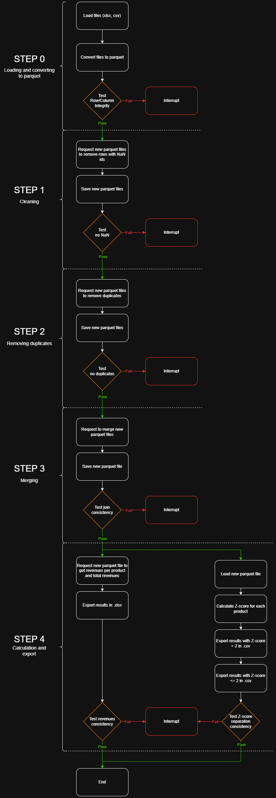

# Orchestrated Monthly Data Pipeline — Kestra & DuckDB

`Python` `Kestra` `DuckDB` `Docker` `Parquet`

---

## Overview

Monthly data pipeline orchestrated with Kestra — covering ingestion, transformation, deduplication, data quality assertions, and parallel analytics reporting.

The focus is on orchestration design, reproducibility, and production-readiness: per-step integrity checks, partial failure isolation between reporting branches, and deliberate format choices driven by query performance constraints.

---

## Architecture decisions

**CSV → Parquet conversion upfront.**  
Expected data volume was unknown at design time. Parquet was chosen defensively: columnar storage reduces I/O on projection-heavy queries, and compression lowers storage footprint regardless of scale. Since all downstream transformations run through DuckDB, Parquet is also the natural fit — DuckDB's native Parquet support avoids any parsing overhead that CSV would introduce at each transformation step.

**Per-step integrity checks rather than end-to-end only.**  
Each transformation stage has its own assertions (null checks, uniqueness on business keys, row count consistency after joins). Catching anomalies at the step level isolates root causes — a failure at deduplication doesn't require re-examining the full pipeline output.

**Parallel execution with partial failure isolation.**  
The two analytical reporting branches (revenue per product, z-score anomaly detection) run in parallel. A failure in one branch does not block delivery of the other. This was a deliberate design choice: reporting branches are independent by nature and should not create artificial dependencies.

**Custom Python Docker image for C-level dependencies.**  
Kestra's `python.Script` task type does not support installation of packages with C-level dependencies at runtime. FastParquet requires compiled C extensions — packaging them into a custom Docker image was the only viable path. This also has a side benefit: dependency resolution happens at build time, not at each execution, which improves pipeline reliability and execution time.

**Z-score for atypical product detection.**  
Business rule requirement. Products with a high z-score on revenue are flagged as vintage/atypical and exported to a separate dataset. The threshold is configurable.

---

## Pipeline



---

## Tech stack

| Layer | Tools |
|---|---|
| Orchestration | Kestra |
| Analytical engine | DuckDB |
| Processing | Python · FastParquet |
| Data formats | Excel → Parquet → CSV |
| Infra | Docker · Docker Compose |

---

## Running the project

### Prerequisites

- Docker & Docker Compose

### Start the services

```bash
docker compose up -d
```

### Build the custom Python image

Required for FastParquet (C-level dependencies not installable at Kestra runtime):

```bash
docker build -t custom-python-312 .
```

### Import the pipeline

- Open Kestra UI: http://localhost:8080/
- Go to **Flows > Import**
- Import `POC_pipeline.yml`

The pipeline is scheduled monthly. Trigger manually from the UI for immediate execution.

---

## Outputs

- Cleaned and deduplicated datasets in Parquet
- `revenue_per_product.csv` — revenue breakdown per product + total
- `vintage_products.csv` — atypical products (high z-score)
- `common_products.csv` — standard product set
- Execution logs, step metrics, and assertion results available in Kestra UI

---

## What's not in scope (and why)

**Cloud storage for outputs** — outputs are written locally. The pipeline structure is storage-agnostic; switching to S3 or GCS would require only a task swap in the Kestra flow, not a pipeline redesign.

**Schema evolution handling** — the input schema is stable for this dataset. Adding schema validation at ingestion is the natural first extension if the source evolves.

---

## Possible extensions

- Schema validation and evolution handling at ingestion
- Output storage to a data lake (S3 / GCS)
- Cloud deployment of Kestra
- Advanced monitoring and alerting on assertion failures
- Parameterization of pipeline inputs (date range, thresholds)
